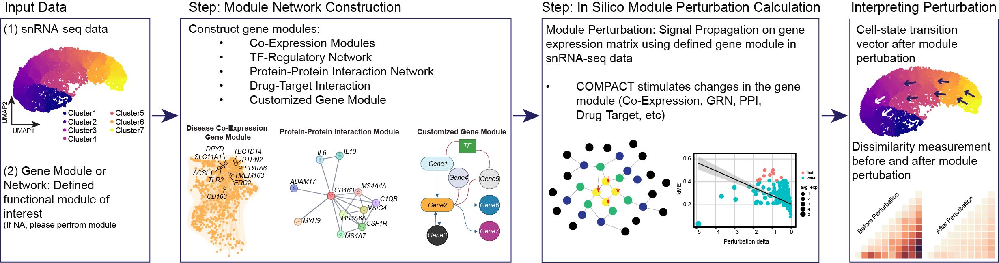

## Co-expression Module Perturbation Analysis in Cellular Transcriptomes

[](https://github.com/smorabit/COMPACT/tree/main)
[](https://github.com/smorabit/COMPACT/issues)

Biological functions are governed by gene regulatory networks that orchestrate a diverse array of dynamic cell states. These networks are altered throughout development, aging, disease, and in response to molecular stimuli, however such perturbations are exceedingly difficult to measure directly with technologies like single-cell RNA-seq (scRNA-seq). Here we propose a novel computational framework, CO-expression Module Perturbation Analysis for Cellular Transcriptomes (**COMPACT**), to perform in-silico gene expression perturbations in single-cell data, and to track downstream changes in cell state dynamics. Building off of our previous method high-dimensional Weighted Gene Co-expression Network Analysis (hdWGCNA), COMPACT applies direct perturbations to co-expression network hub genes, and uses the network structure to propagate the perturbation signal to other linked genes. This framework is highly flexible to perform knock-in, knock-down, or knock-out perturbations on different networks and sets of genes and in different cell lineages, allowing researchers to explore a wide range of strategies mimicking various experimental conditions and interventions. We demonstrate the efficacy of COMPACT across established paradigms of cellular dynamic response, including mouse oligodendrocyte differentiation, human disease-associated microglia, and existing single-cell perturbation data. Notably, our in-silico perturbation simulations with COMPACT have unveiled disease-relevant phenotypic outcomes resulting from co-expression module perturbations in human disease-associated microglia. These findings offer valuable insights into the molecular mechanisms underlying cellular states in disease, and identify novel targets for therapeutic intervention. In summary, our work introduces COMPACT as a powerful tool for functionally dissecting gene network perturbations and elucidating their disease-relevant impact. By leveraging the wealth of information contained within single-cell transcriptomic data, COMPACT facilitates comprehensive analyses of gene regulatory networks, paving the way for advancements in our understanding of cellular dynamics and disease pathology.




*Figure 1. The COMPACT workflow pipeline illustrating major steps of co-expression module perturbation analysis.*


## Installation

The current version of **COMPACT** is an alpha release, and we are actively developing and improving the package. We welcome any suggestions or feedback you may have.

We recommend creating an R [conda environment](https://docs.conda.io/en/latest/) environment for COMPACT.

Setting up a Conda Environment: This ensures isolated package dependencies, avoiding conflicts.

```bash
# Step 1: Create a new conda environment for R
conda create -n COMPACT -c conda-forge r-base r-essentials

# Step 2: Activate the new conda environment
conda activate COMPACT

```

Now you can install the COMPACT package using `devtools`.

```r

# Step 3: Install the COMPACT package
devtools::install_github('smorabit/COMPACT')

```

Optional Installation: Install velocyto.R for using functions from RNA velocity for analysis

```r
install_github("velocyto-team/velocyto.R")

```
