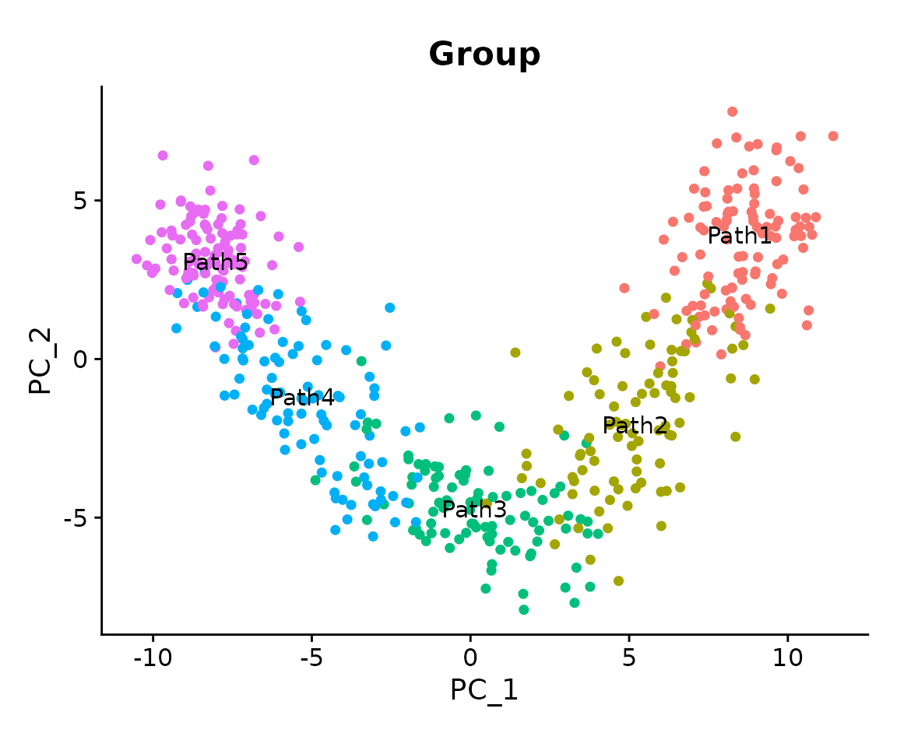
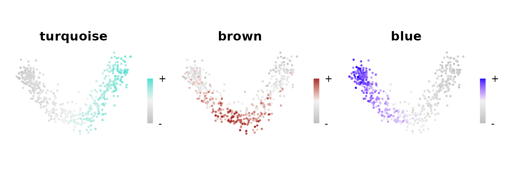
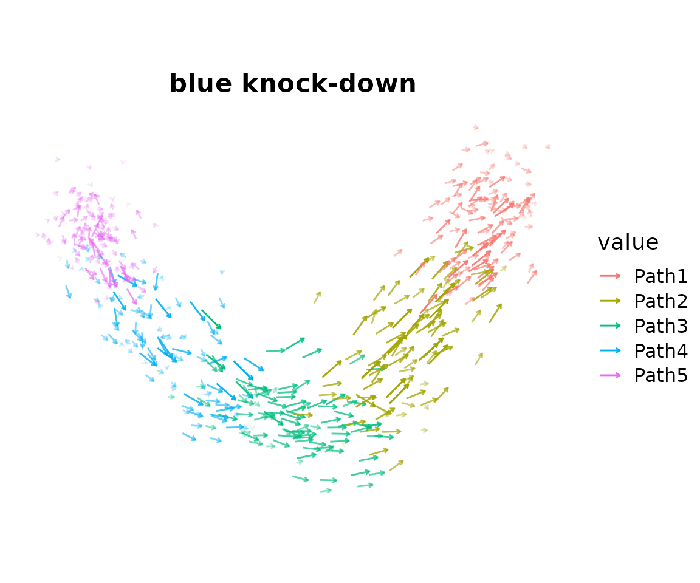

# Quick start

Compiled: 2026-05-20

Source: `vignettes/quickstart.Rmd`

## Introduction

**`compact`** (**co**-expression **m**odule **p**erturbation
**a**nalysis for **c**ellular **t**ranscriptomes) is an R package for
in-silico gene perturbation analysis in single-cell RNA-seq data. Given
a gene co-expression module, compact inhibits or activates the module’s
hub genes, propagates the signal via the gene co-expression network, and
computes cell-cell transition probabilities allowing you to ask: *if
this module were knocked down, knocked out, or knocked in, which cell
states would cells move toward?*

This quickstart vignette covers a minimal compact workflow where we
perform a knock-down of one module and visualize the result as a vector
field plot. We describe several of the key parameters, but for
algorithmic depth, multiple modules, and downstream Markov-chain
analyses, see the **Basics Simulation** vignette.

> **Prerequisite:** The dataset used here already has co-expression
> modules computed with `hdWGCNA`. If you need to run hdWGCNA on your
> own data first, start with the [hdWGCNA
> tutorial](https://smorabit.github.io/hdWGCNA/articles/basic_tutorial.html).
> Optionally you can view the code below to see how the dataset was
> generated and processed.

**Dataset generation: simulation and preprocessing steps (click to
expand)**

The dataset was generated from scratch using **splatter** to simulate a
linear single-cell trajectory, then processed through Seurat and
hdWGCNA. These steps are provided here for full reproducibility; they do
not need to be re-run if you are loading the pre-processed object below.

**Simulate a linear trajectory scRNA-seq dataset with splatter**

``` r

library(Seurat)
library(tidyverse)
library(cowplot)
library(patchwork)
library(hdWGCNA)
library(compact)

theme_set(theme_cowplot())
set.seed(12345)

library(splatter)
library(scater)

params <- newSplatParams()
params <- setParam(params, "nGenes", 1500)          # 1,500 genes
params <- setParam(params, "batchCells", 500)        # 500 cells
params <- setParam(params, "lib.loc", 8)
params <- setParam(params, "path.nonlinearProb", 0.1)

sim_path <- splatSimulatePaths(
  params,
  group.prob = c(0.2, 0.2, 0.2, 0.2, 0.2),   # 5 equally-sized groups
  de.prob    = 0.75,
  de.facLoc  = 0.2,
  path.from  = c(0, 1, 2, 3, 4),              # linear chain: 1 → 2 → 3 → 4 → 5
  seed       = 12345,
  verbose    = FALSE
)

# remove genes with no zero counts (fully non-sparse genes confound ZINB modeling)
X <- counts(sim_path)
exclude_genes <- names(which(rowMins(X) > 0))
X <- X[setdiff(rownames(X), exclude_genes), ]

seurat_obj <- CreateSeuratObject(
  counts    = X,
  meta.data = as.data.frame(colData(sim_path))
)
```

**Process the data with Seurat**

``` r

seurat_obj <- NormalizeData(seurat_obj)
seurat_obj <- FindVariableFeatures(seurat_obj)
seurat_obj <- ScaleData(seurat_obj)
seurat_obj <- RunPCA(seurat_obj)
seurat_obj <- FindNeighbors(seurat_obj, reduction = 'pca', annoy.metric = 'cosine')
seurat_obj <- RunUMAP(seurat_obj, dims = 1:10)
```

**Co-expression network analysis with hdWGCNA**

``` r

# set up hdWGCNA using all genes
seurat_obj <- SetupForWGCNA(
  seurat_obj,
  features   = rownames(seurat_obj),
  wgcna_name = "linear"
)

# construct metacells within each group for robust co-expression estimation
seurat_obj <- MetacellsByGroups(
  seurat_obj      = seurat_obj,
  group.by        = c("Group"),
  reduction       = 'pca',
  k               = 10,
  max_shared      = 5,
  ident.group     = 'Group',
  target_metacells = 100,
  min_cells       = 5
)
seurat_obj <- NormalizeMetacells(seurat_obj)

# fit soft-power threshold and construct the co-expression network
seurat_obj <- SetDatExpr(seurat_obj)
seurat_obj <- TestSoftPowers(seurat_obj)
seurat_obj <- ConstructNetwork(
  seurat_obj,
  soft_power   = 4,
  tom_name     = 'sim_linear',
  overwrite_tom = TRUE
)

# compute module eigengenes and hub gene connectivity scores
seurat_obj <- ModuleEigengenes(seurat_obj)
seurat_obj <- ModuleConnectivity(seurat_obj)

saveRDS(seurat_obj, file = 'data/simulation_linear.rds')
```

------------------------------------------------------------------------

## Load Libraries and Data

``` r

library(Seurat)
library(tidyverse)
library(cowplot)
library(patchwork)
library(hdWGCNA)
library(compact)

theme_set(theme_cowplot())
set.seed(12345)
```

Load the simulated linear-trajectory dataset. This object has been
processed through Seurat (normalization, PCA, UMAP) and hdWGCNA
(co-expression network, module identification). The co-expression
network (TOM) is stored as a separate file; update the path below if
your working directory differs.

``` r

# TODO: update this block once this Seurat object is included in the package
seurat_obj <- readRDS('/home/groups/singlecell/smorabito/analysis/COMPACT/data/simulation_linear.rds')

# Update the TOM file path to match your local directory
net <- GetNetworkData(seurat_obj)
net$TOMFiles <- '/home/groups/singlecell/smorabito/analysis/COMPACT/TOM/sim_linear_TOM.rda'
seurat_obj <- SetNetworkData(seurat_obj, net)
```

To better understand the dataset, we first visualize the different cell
clusters on the PCA embedding. In principle, we used **splatter** to
generate five clusters ordered along a single linear “differentiation”
trajectory.

``` r

DimPlot(
  seurat_obj,
  reduction = 'pca',
  group.by  = 'Group',
  label     = TRUE,
  pt.size   = 1.5
) + NoLegend() + coord_equal() 
```



To see which region of the embedding each co-expression module is active
in, we plot the module eigengenes (MEs, the summary expression level of
each module) in the same embedding:

``` r

plot_list <- ModuleFeaturePlot(
  seurat_obj,
  reduction = 'pca',
  features  = 'MEs',
  order     = TRUE
)
#> [1] "turquoise"
#> [1] "brown"
#> [1] "blue"
wrap_plots(plot_list, ncol = 3)
```



Here we see two modules which represent the extreme ends of the linear
trajectory, with the turquoise module expressed in the “Path1” group,
the blue module expressed in the “Path5” group, and the brown module
expressed in the middle of the trajectory.

------------------------------------------------------------------------

## Build the cell-cell neighborhood graph

compact requires a cell-cell neighborhood graph to compute transition
probabilities: critically, transition probabilities are only evaluated
between neighboring cells. `FindNeighbors` only needs to be called once,
and all subsequent `ModulePerturbation` calls reuse the same graph.

``` r

seurat_obj <- FindNeighbors(
  seurat_obj,
  reduction    = 'pca',
  dims         = 1:10,
  k.param      = 20,        
  annoy.metric = 'cosine'  
)
```

`FindNeighbors` stores two graphs in the Seurat object: `RNA_nn` (KNN)
and `RNA_snn` (shared nearest neighbors). We use the SNN graph
(`RNA_snn`) for `ModulePerturbation` in the next section.

> **Tip:** If you ran `FindNeighbors` during standard Seurat
> preprocessing, you can skip this step and pass the existing graph
> directly to `ModulePerturbation`. Check which graphs are available
> with `names(seurat_obj@graphs)`.

------------------------------------------------------------------------

## Run the Perturbation

`ModulePerturbation` is the core function of compact. Internally it:

1.  **`ApplyPerturbation`** modifies expression of the module’s top hub
    genes in the direction specified by `perturb_dir`
2.  **`ApplyPropagation`** diffuses that signal through the gene
    co-expression network
3.  **`PerturbationTransitions`** computes cell-cell transition
    probabilities on the cell-cell neighborhood graph

Here we knock down the **blue** module using `perturb_dir = -1`. The
result is stored as a new assay and a new transition probability graph
inside the Seurat object.

``` r

seurat_obj <- ModulePerturbation(
  seurat_obj,
  mod = 'blue',   
  perturb_dir = -1,  
  perturbation_name = 'blue_down',
  graph  = 'RNA_snn', 
  n_hubs = 10, 
  delta_scale = 0.2, 
  n_iters = 3     
) 
#> [1] "Applying primary in-silico perturbation to hub genes..."
#>   |                                                          |                                                  |   0%  |                                                          |=====                                             |  10%  |                                                          |==========                                        |  20%  |                                                          |===============                                   |  30%  |                                                          |====================                              |  40%  |                                                          |=========================                         |  50%  |                                                          |==============================                    |  60%  |                                                          |===================================               |  70%  |                                                          |========================================          |  80%  |                                                          |=============================================     |  90%  |                                                          |==================================================| 100%
#> [1] "Applying log-space signal propagation throughout co-expression network..."
#> [1] "Computing cell-cell transition probabilities based on the perturbation..."
```

**Expected runtime:** 1–2 minutes on a laptop with a 500-cell dataset.

**Key parameters:**

| Parameter | Value | What it controls |
|----|----|----|
| `perturb_dir` | `-1` | Direction: negative = knock-down, positive = knock-in, `0` = knock-out |
| `n_hubs` | `10` | Number of hub genes to perturb directly; signal diffuses from these to the rest |
| `delta_scale` | `0.2` | Propagation dampening; lower values reduce risk of signal saturation |
| `n_iters` | `3` | Propagation steps through the network |

> **Troubleshooting graph name mismatch:** If you see an error like
> *“Graph ‘RNA_snn’ not found”*, the graph name in your object may
> differ. Check with `names(seurat_obj@graphs)` and update the `graph=`
> argument to match.

------------------------------------------------------------------------

## Visualize the Vector Field

`PlotTransitionVectors` projects the cell-cell transition probabilities
onto the 2D embedding as a vector field analogous to an RNA velocity
plot. Here we plot one arrow per cell, showing the local direction of
transitions induced by the in-silico knockdown of the blue module.

``` r

PlotTransitionVectors(
  seurat_obj,
  perturbation_name = 'blue_down',
  reduction = 'pca',
  color.by = 'Group',   
  plot_mode = 'cells',
  arrow_scale = 1.5,
  arrow_size = 0.5           
) + ggtitle('blue knock-down') + coord_equal() 
```



**What to look for:** Previously, we saw the expression of the blue
module on the left side of the trajectory. Therefore, we expect that an
in-silico downregulation of this module would cause cells to transition
from the left side towards the right side of the trajectory. Indeed, in
this case we do that see many of the transition arrows follow this
expected directionality.

> **Tip:** `arrow_scale` controls only the visual arrow length it does
> not affect the underlying transition probabilities. Adjust it freely
> until the arrows are legible. If arrows appear too small, increase it;
> if they overlap, decrease it.

------------------------------------------------------------------------

## Next steps

This quickstart covers the absolute minimal compact workflow. We
encourage you to explore the other vignettes to unlock the full
capabilities of compact.

- **Basics Simulation** (`simulation_tutorial.Rmd`): full pipeline on a
  branching trajectory both perturbation directions, all modules, vector
  field coherence scoring, and all four Markov-chain analyses
  (`PredictPerturbationTime`, `PredictAttractors`, `PredictFates`,
  `PredictCommitment`).

- **Basics Real Dataset** (`basic_tutorial.Rmd`): compact applied to a
  real Alzheimer’s disease microglia atlas `AlertSystemScore`,
  `ComputeDistance`, and `FindShapKeyDriver` for interpretable driver
  gene prioritization.

- **Advanced Use Cases** (`TF_tutorial.Rmd`): `TFPerturbation` for
  transcription factor–based perturbations using a regulatory network,
  and `CustomPerturbation` for arbitrary gene sets.

``` r

sessionInfo()
#> R version 4.5.3 (2026-03-11)
#> Platform: x86_64-conda-linux-gnu
#> Running under: CentOS Linux 7 (Core)
#> 
#> Matrix products: default
#> BLAS/LAPACK: /home/groups/singlecell/smorabito/.conda/envs/compact_fresh/lib/libopenblasp-r0.3.32.so;  LAPACK version 3.12.0
#> 
#> locale:
#>  [1] LC_CTYPE=en_US.UTF-8       LC_NUMERIC=C              
#>  [3] LC_TIME=en_US.UTF-8        LC_COLLATE=en_US.UTF-8    
#>  [5] LC_MONETARY=en_US.UTF-8    LC_MESSAGES=en_US.UTF-8   
#>  [7] LC_PAPER=en_US.UTF-8       LC_NAME=C                 
#>  [9] LC_ADDRESS=C               LC_TELEPHONE=C            
#> [11] LC_MEASUREMENT=en_US.UTF-8 LC_IDENTIFICATION=C       
#> 
#> time zone: Europe/Madrid
#> tzcode source: system (glibc)
#> 
#> attached base packages:
#> [1] stats4    stats     graphics  grDevices utils     datasets  methods  
#> [8] base     
#> 
#> other attached packages:
#>  [1] future_1.70.0               compact_0.1.0              
#>  [3] hdWGCNA_0.4.11              enrichR_3.4                
#>  [5] SummarizedExperiment_1.40.0 Biobase_2.70.0             
#>  [7] MatrixGenerics_1.22.0       matrixStats_1.5.0          
#>  [9] GenomicRanges_1.62.1        Seqinfo_1.0.0              
#> [11] IRanges_2.44.0              S4Vectors_0.48.0           
#> [13] BiocGenerics_0.56.0         generics_0.1.4             
#> [15] GeneOverlap_1.46.0          UCell_2.14.0               
#> [17] tidygraph_1.3.0             ggraph_2.2.2               
#> [19] igraph_2.3.1                WGCNA_1.74                 
#> [21] fastcluster_1.3.0           dynamicTreeCut_1.63-1      
#> [23] ggrepel_0.9.8               harmony_2.0.2              
#> [25] Rcpp_1.1.1-1.1              patchwork_1.3.2            
#> [27] cowplot_1.2.0               lubridate_1.9.5            
#> [29] forcats_1.0.1               stringr_1.6.0              
#> [31] dplyr_1.2.1                 purrr_1.2.2                
#> [33] readr_2.2.0                 tidyr_1.3.2                
#> [35] tibble_3.3.1                ggplot2_4.0.3              
#> [37] tidyverse_2.0.0             Seurat_5.5.0               
#> [39] SeuratObject_5.4.0          sp_2.2-1                   
#> 
#> loaded via a namespace (and not attached):
#>   [1] fs_2.1.0                    spatstat.sparse_3.1-0      
#>   [3] bitops_1.0-9                httr_1.4.8                 
#>   [5] RColorBrewer_1.1-3          doParallel_1.0.17          
#>   [7] tools_4.5.3                 sctransform_0.4.3          
#>   [9] backports_1.5.1             R6_2.6.1                   
#>  [11] lazyeval_0.2.3              uwot_0.2.4                 
#>  [13] withr_3.0.2                 gridExtra_2.3              
#>  [15] preprocessCore_1.72.0       progressr_0.19.0           
#>  [17] cli_3.6.6                   textshaping_1.0.5          
#>  [19] spatstat.explore_3.8-0      fastDummies_1.7.6          
#>  [21] labeling_0.4.3              sass_0.4.10                
#>  [23] S7_0.2.2                    spatstat.data_3.1-9        
#>  [25] proxy_0.4-29                ggridges_0.5.7             
#>  [27] pbapply_1.7-4               pkgdown_2.2.0              
#>  [29] systemfonts_1.3.2           foreign_0.8-91             
#>  [31] pscl_1.5.9                  parallelly_1.47.0          
#>  [33] WriteXLS_6.8.0              VGAM_1.1-14                
#>  [35] rstudioapi_0.18.0           impute_1.84.0              
#>  [37] gtools_3.9.5                ica_1.0-3                  
#>  [39] spatstat.random_3.4-5       car_3.1-5                  
#>  [41] Matrix_1.7-5                abind_1.4-8                
#>  [43] lifecycle_1.0.5             yaml_2.3.12                
#>  [45] carData_3.0-6               gplots_3.3.0               
#>  [47] SparseArray_1.10.8          Rtsne_0.17                 
#>  [49] grid_4.5.3                  promises_1.5.0             
#>  [51] miniUI_0.1.2                lattice_0.22-9             
#>  [53] pillar_1.11.1               knitr_1.51                 
#>  [55] rjson_0.2.23                xgboost_3.2.0.1            
#>  [57] future.apply_1.20.2         codetools_0.2-20           
#>  [59] glue_1.8.1                  spatstat.univar_3.1-7      
#>  [61] data.table_1.18.2.1         vctrs_0.7.3                
#>  [63] png_0.1-9                   spam_2.11-3                
#>  [65] gtable_0.3.6                cachem_1.1.0               
#>  [67] xfun_0.57                   S4Arrays_1.10.1            
#>  [69] mime_0.13                   survival_3.8-6             
#>  [71] SingleCellExperiment_1.32.0 iterators_1.0.14           
#>  [73] fitdistrplus_1.2-6          ROCR_1.0-12                
#>  [75] nlme_3.1-169                SHAPforxgboost_0.2.0       
#>  [77] RcppAnnoy_0.0.23            bslib_0.10.0               
#>  [79] irlba_2.3.7                 KernSmooth_2.23-26         
#>  [81] otel_0.2.0                  rpart_4.1.27               
#>  [83] colorspace_2.1-2            Hmisc_5.2-5                
#>  [85] nnet_7.3-20                 tidyselect_1.2.1           
#>  [87] compiler_4.5.3              curl_7.1.0                 
#>  [89] htmlTable_2.5.0             BiocNeighbors_2.4.0        
#>  [91] desc_1.4.3                  DelayedArray_0.36.0        
#>  [93] plotly_4.12.0               checkmate_2.3.4            
#>  [95] scales_1.4.0                caTools_1.18.3             
#>  [97] lmtest_0.9-40               digest_0.6.39              
#>  [99] goftest_1.2-3               spatstat.utils_3.2-2       
#> [101] rmarkdown_2.31              XVector_0.50.0             
#> [103] htmltools_0.5.9             pkgconfig_2.0.3            
#> [105] base64enc_0.1-6             fastmap_1.2.0              
#> [107] rlang_1.2.0                 htmlwidgets_1.6.4          
#> [109] BBmisc_1.13.1               shiny_1.13.0               
#> [111] farver_2.1.2                jquerylib_0.1.4            
#> [113] zoo_1.8-15                  jsonlite_2.0.0             
#> [115] BiocParallel_1.44.0         magrittr_2.0.5             
#> [117] Formula_1.2-5               dotCall64_1.2              
#> [119] viridis_0.6.5               reticulate_1.46.0          
#> [121] stringi_1.8.7               MASS_7.3-65                
#> [123] plyr_1.8.9                  parallel_4.5.3             
#> [125] listenv_0.10.1              deldir_2.0-4               
#> [127] graphlayouts_1.2.3          splines_4.5.3              
#> [129] tensor_1.5.1                hms_1.1.4                  
#> [131] rdist_0.0.5                 ggpubr_0.6.3               
#> [133] spatstat.geom_3.7-3         ggsignif_0.6.4             
#> [135] RcppHNSW_0.6.0              reshape2_1.4.5             
#> [137] evaluate_1.0.5              tester_0.3.0               
#> [139] tzdb_0.5.0                  foreach_1.5.2              
#> [141] tweenr_2.0.3                httpuv_1.6.17              
#> [143] RANN_2.6.2                  polyclip_1.10-7            
#> [145] scattermore_1.2             ggforce_0.5.0              
#> [147] broom_1.0.12                xtable_1.8-8               
#> [149] RSpectra_0.16-2             rstatix_0.7.3              
#> [151] later_1.4.8                 viridisLite_0.4.3          
#> [153] ragg_1.5.2                  memoise_2.0.1              
#> [155] cluster_2.1.8.2             timechange_0.4.0           
#> [157] globals_0.19.1
```
