# Module perturbation on a branching trajectory

Compiled: 2026-05-20

Source: `vignettes/simulation_tutorial.Rmd`

## Introduction

**`compact`** (**co**-expression **m**odule **p**erturbation
**a**nalysis for **c**ellular **t**ranscriptomes) is an R package for
in-silico gene perturbation analysis in single-cell RNA-seq data.
**`compact`** builds on **hdWGCNA**, our previous package for weighted
gene co-expression network analysis in single-cell data. If you are
unfamiliar with co-expression modules or need to run hdWGCNA yourself,
we recommend starting with the [hdWGCNA
tutorial](https://smorabit.github.io/hdWGCNA/articles/basic_tutorial.html).

## Setup and data loading

For this tutorial, we use a **splatter** simulated scRNA-seq dataset of
~4,800 cells and ~6,000 genes. We simulated 3 distinct branches with 4
cell populations each to recapitulate a **branching developmental
trajectory**. First, we will load the required libraries (Seurat,
hdWGCNA, compact, etc) and the simulated dataset.

> **Prerequisite:** The dataset used here already has co-expression
> modules computed with `hdWGCNA`. If you need to run hdWGCNA on your
> own data first, start with the [hdWGCNA
> tutorial](https://smorabit.github.io/hdWGCNA/articles/basic_tutorial.html).
> Optionally you can expand the section below to see how the dataset was
> generated and preprocessed.

**Dataset generation: simulation and preprocessing steps (click to
expand)**

The dataset was generated synthetically using **splatter** to simulate a
branching single-cell trajectory, then processed through Seurat,
Monocle3, and hdWGCNA. These steps are provided here for full
reproducibility; they do not need to be re-run if you are loading the
pre-processed object.

**Create a simulated scRNA-seq dataset with a branching trajectory**

``` r

library(Seurat)
library(tidyverse)
library(cowplot)
library(patchwork)
library(hdWGCNA)
library(compact)

theme_set(theme_cowplot())
set.seed(12345)

library(splatter)
library(scater)

params <- newSplatParams()
params <- setParam(params, "nGenes", 6000)
params <- setParam(params, "batchCells", 4800)
params <- setParam(params, "lib.loc", 8)

# three-branch path: shared root bifurcates twice into 12 ordered groups
path <- c(0, 1, 2, 2, 3, 5, 6, 7, 3, 9, 10, 11)

sim_path <- splatSimulatePaths(
    params,
    group.prob = rep(1 / length(path), length(path)),
    de.prob    = 0.75,
    de.facLoc  = 0.2,
    path.from  = path,
    verbose    = FALSE
)

# remove genes with no zero counts (fully non-sparse genes confound ZINB modeling)
X <- counts(sim_path)
exclude_genes <- names(which(rowMins(X) > 0))
X <- X[setdiff(rownames(X), exclude_genes), ]

seurat_obj <- CreateSeuratObject(
    counts    = X,
    meta.data = as.data.frame(colData(sim_path))
)
```

**Process the data with Seurat**

``` r

seurat_obj <- NormalizeData(seurat_obj)
seurat_obj <- FindVariableFeatures(seurat_obj)
seurat_obj <- ScaleData(seurat_obj)
seurat_obj <- RunPCA(seurat_obj)
```

**Calculate the pseudotime trajectory with monocle3**

``` r

library(monocle3)
library(SeuratWrappers)

# convert to CDS and reuse PCA coordinates as the 2D embedding for graph learning
cds <- as.cell_data_set(seurat_obj)
cds@int_colData@listData$reducedDims@listData$UMAP <-
    cds@int_colData@listData$reducedDims$PCA[, 1:2]

cds <- cluster_cells(cds, reduction_method = 'UMAP')
cds <- learn_graph(cds)

# root principal node identified by visual inspection of the learned graph
cds <- order_cells(cds, root_pr_nodes = 'Y_49')
seurat_obj$pseudotime <- pseudotime(cds)

# assign branch labels
branch0 <- c('Path1', 'Path2', 'Path3', 'Path4')
branch1 <- c('Path5', 'Path6', 'Path7', 'Path8')
branch2 <- c('Path9', 'Path10', 'Path11', 'Path12')

seurat_obj$branch <- case_when(
    seurat_obj$Group %in% branch0 ~ 'Branch 1',
    seurat_obj$Group %in% branch1 ~ 'Branch 2',
    seurat_obj$Group %in% branch2 ~ 'Branch 3'
)

# branch-specific pseudotime (NA for cells outside each branch)
b1_path <- c('Path1', 'Path2', 'Path3', 'Path4', 'Path5', 'Path6', 'Path7', 'Path8')
b2_path <- c('Path1', 'Path2', 'Path3', 'Path4', 'Path9', 'Path10', 'Path11', 'Path12')
seurat_obj$b1_pseudotime <- ifelse(seurat_obj$Group %in% b1_path, seurat_obj$pseudotime, NA)
seurat_obj$b2_pseudotime <- ifelse(seurat_obj$Group %in% b2_path, seurat_obj$pseudotime, NA)

# rename splatter path labels to human-readable branch-position labels
seurat_obj@meta.data <- seurat_obj@meta.data %>%
    mutate(Group = recode(Group,
        "Path1"  = "B1-1",  "Path2"  = "B1-2",  "Path4"  = "B1-3",  "Path3"  = "B1-4",
        "Path5"  = "B2-1",  "Path6"  = "B2-2",  "Path7"  = "B2-3",  "Path8"  = "B2-4",
        "Path9"  = "B3-1",  "Path10" = "B3-2",  "Path11" = "B3-3",  "Path12" = "B3-4"
    ))
```

**Co-expression network analysis with hdWGCNA**

``` r

seurat_obj <- SetupForWGCNA(
    seurat_obj,
    gene_select = "fraction",
    fraction    = 0.05,
    wgcna_name  = "simulation",
    group.by    = 'Group'
)

seurat_obj <- MetacellsByGroups(
    seurat_obj       = seurat_obj,
    group.by         = c("Group"),
    reduction        = 'pca',
    k                = 25,
    max_shared       = 10,
    ident.group      = 'Group',
    target_metacells = 50
)
seurat_obj <- NormalizeMetacells(seurat_obj)
seurat_obj <- SetDatExpr(seurat_obj)
seurat_obj <- TestSoftPowers(seurat_obj)

seurat_obj <- ConstructNetwork(
    seurat_obj,
    tom_name      = 'sim',
    overwrite_tom = TRUE
)

seurat_obj <- ModuleEigengenes(seurat_obj, group.by = 'branch')
seurat_obj <- ModuleConnectivity(seurat_obj)

saveRDS(seurat_obj, file = file.path(data_dir, 'simulation_branch.rds'))
```

### Loading the dataset and required libraries

Start by loading the required libraries:

``` r

library(Seurat)
library(tidyverse)
library(cowplot)
library(patchwork)
library(RColorBrewer)
library(hdWGCNA)
library(compact)

theme_set(theme_cowplot())
set.seed(12345)
```

The dataset for this tutorial must be downloaded separately from Zenodo.

- `simulation_branch.rds` (Seurat object, ~50 MB) — [Download from
  Zenodo](https://drive.google.com/file/d/PLACEHOLDER_simulation_branch)
- `sim_TOM.rda` (co-expression network TOM, ~5 MB) — [Download from
  Zenodo](https://drive.google.com/file/d/PLACEHOLDER_sim_TOM)

After downloading, set `data_dir` to the folder containing both files
and load the data:

``` r

# set this to the directory where you downloaded the data files
data_dir <- '/path/to/your/data/'

seurat_obj <- readRDS(file.path(data_dir, 'simulation_branch.rds'))

# register the TOM file path inside the Seurat object
net <- GetNetworkData(seurat_obj)
net$TOMFiles <- file.path(data_dir, 'sim_TOM.rda')
seurat_obj <- SetNetworkData(seurat_obj, net)
```

### Plot the clusters

We familiarize ourselves with the dataset by plotting the different
groups as a PCA dimensional reduction plot.

``` r

cp <- c(
    rev(brewer.pal(5, "Oranges")[2:5]),  # Branch 1: B1-1, B1-2, B1-3, B1-4
    brewer.pal(5, "Greens")[2:5],        # Branch 2: B2-1, B2-2, B2-3, B2-4
    brewer.pal(5, "Purples")[2:5]        # Branch 3: B3-1, B3-2, B3-3, B3-4
)
names(cp) <- c(
    'B1-1', 'B1-2', 'B1-3', 'B1-4',
    'B2-1', 'B2-2', 'B2-3', 'B2-4',
    'B3-1', 'B3-2', 'B3-3', 'B3-4'
)

DimPlot(
    seurat_obj,
    reduction = 'pca',
    group.by = 'Group',
    cols = cp,
    label = FALSE,
    pt.size = 1
) + coord_equal() + NoLegend()
```

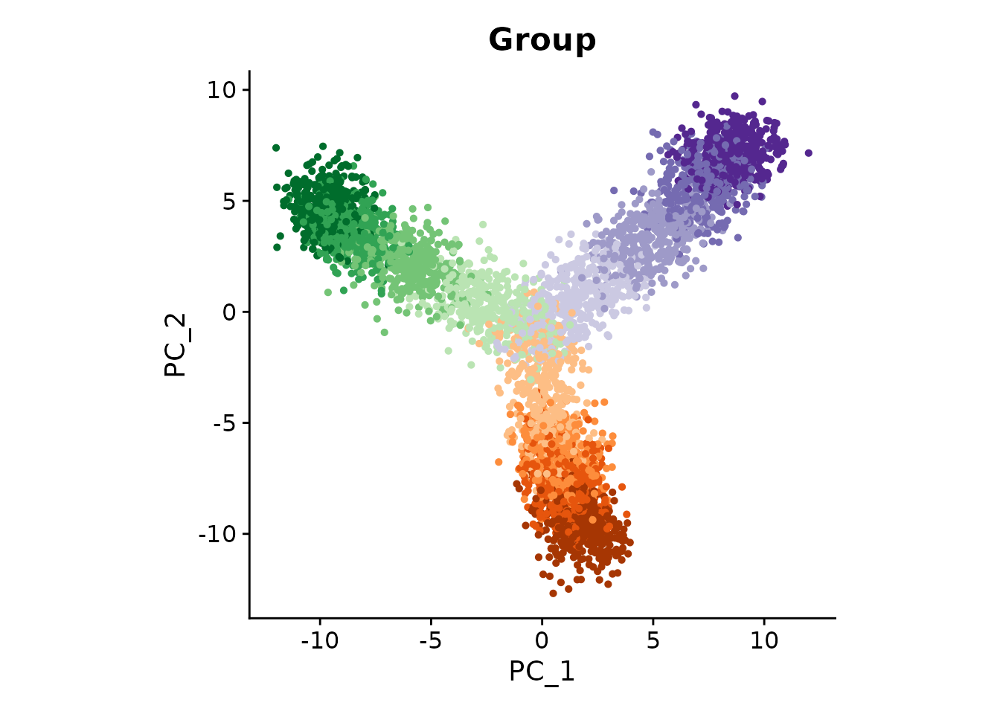

### Plot Module Eigengenes

We next inspect the expression level of each gene co-expression module
identified by hdWGCNA.

``` r

plot_list <- ModuleFeaturePlot(
    seurat_obj,
    reduction = 'pca',
    features = 'MEs',
    order = TRUE
)
#> [1] "yellow"
#> [1] "brown"
#> [1] "blue"
#> [1] "red"
#> [1] "green"
#> [1] "turquoise"

wrap_plots(plot_list, ncol = 3)
```

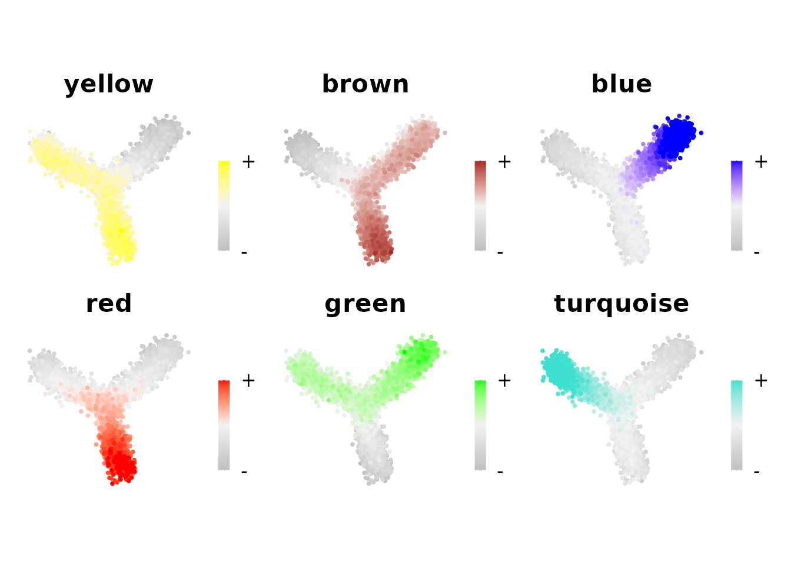

hdWGCNA identified six modules in this dataset. Three are specifically
expressed in one branch (blue, red, and turquoise), while the other
three are specifically inactive in one branch (yellow, brown, and
green). In this tutorial, we focus on perturbing the turquoise module
with **`compact`**.

------------------------------------------------------------------------

## Build the cell-cell neighborhood graph

Before running `ModulePerturbation`, we must construct a
nearest-neighbor graph. This graph defines the **local neighborhoods**
over which `compact` computes cell-cell transition probabilities.
Essentially, transition probabilities are only computed between
neighboring cells in the graph.

Run `FindNeighbors` to build the SNN (shared nearest neighbor) graph:

``` r

seurat_obj <- FindNeighbors(
    seurat_obj,
    reduction = 'pca',
    assay = 'RNA',
    k.param = 20,
    annoy.metric = 'cosine'
)
```

**Parameters:**

- `k.param = 20`: Each cell connects to its 20 nearest neighbors in PCA
  space. For datasets with 1,000s of cells, values between 15 and 50
  typically work well; for smaller datasets, lower values are
  appropriate.
- `annoy.metric = 'cosine'`: Use cosine distance (standard for
  high-dimensional gene expression data). Alternative: `'euclidean'`.
- `reduction = 'pca'`: Compute neighbors in PCA space rather than the
  full gene expression matrix (more efficient and robust).

The SNN graph is stored in the Seurat object at
`seurat_obj@graphs[['RNA_snn']]`. This is the graph `ModulePerturbation`
will use to compute transition probabilities in the next section.

> **Note:** The graph is only computed once, even if you perform
> multiple perturbations. You can run `ModulePerturbation` sequentially
> for different modules or different perturbation directions without
> re-running `FindNeighbors`.

### Checking graph connectivity

A critical requirement is that the SNN graph should be **fully
connected** every cell should be reachable from every other cell through
the graph edges. If the graph has isolated components, transition
probability mass is trapped within those regions during
`ModulePerturbation`, producing artefactual attractor states or flat
pseudotime values in disconnected areas.

The choice of `k.param` has the largest effect on connectivity. Too few
neighbors leaves sparse or peripheral cells with no shared-neighbor
edges after SNN pruning, splitting the graph into isolated pieces. Too
many neighbors blurs local neighborhood structure. We recommend sweeping
a few candidate values and checking connectivity with
`FindConnectedComponents` before committing to a final graph.

`compact` provides `FindConnectedComponents` to detect this condition.
It labels each cell by its connected component and warns you if more
than one is found. Below we run `FindNeighbors` with four representative
`k.param` values and save the component labels from each run under a
unique column name, allowing us to compare all four results
side-by-side:

``` r

param_sets <- list(
    list(k = 2,  label = 'k2'),
    list(k = 10, label = 'k10'),
    list(k = 20, label = 'k20'),
    list(k = 50, label = 'k50')
)

for (ps in param_sets) {
    seurat_obj <- FindNeighbors(
        seurat_obj,
        reduction    = 'pca',
        assay        = 'RNA',
        k.param      = ps$k,
        annoy.metric = 'cosine',
        verbose      = FALSE
    )
    seurat_obj <- FindConnectedComponents(
        seurat_obj,
        graph          = 'RNA_snn',
        meta_data_name = paste0('cc_', ps$label),
        verbose        = FALSE
    )
}
```

We can now visualize the results side-by-side.

``` r

plot_list <- lapply(param_sets, function(ps) {
    col_name <- paste0('cc_', ps$label)
    n_comp   <- nlevels(seurat_obj@meta.data[[col_name]])
    status   <- if (n_comp == 1) '1 component' else paste0(n_comp, ' components')

    DimPlot(
        seurat_obj,
        reduction = 'pca',
        group.by  = col_name,
        pt.size   = 0.5
    ) +
        coord_equal() +
        NoLegend() +
        ggtitle(paste0('k=', ps$k, '  (', status, ')'))
})

wrap_plots(plot_list, ncol = 2)
```

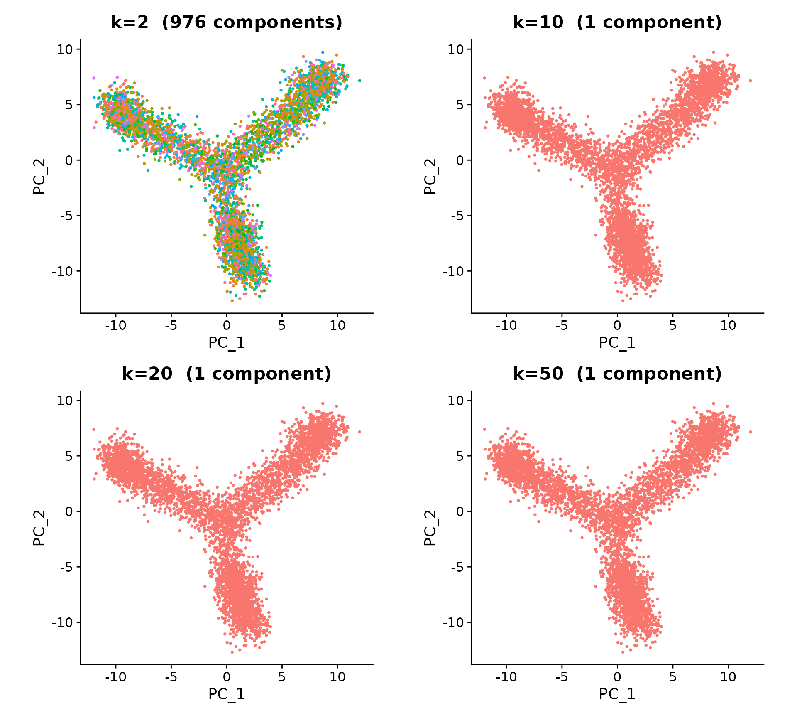

In this example, `k.param = 2` was the only tested value that yielded
more than one component, although this is an unrealistically low value
to use in a practical setting.

> **Note:** In the case where multiple components are detected using a
> higher `k.param` value, we advise that the user consider subsetting
> their object to only perform the downstream analysis on a single
> connected component of the graph.

For this dataset, we proceed with `k.param = 20`.

``` r

seurat_obj <- FindNeighbors(
    seurat_obj,
    reduction    = 'pca',
    assay        = 'RNA',
    k.param      = 20,
    annoy.metric = 'cosine'
)
seurat_obj <- FindConnectedComponents(
    seurat_obj,
    graph   = 'RNA_snn'
)
```

------------------------------------------------------------------------

## Running `ModulePerturbation`

`ModulePerturbation` is the core function of `compact`. It performs
three sequential steps internally:

1.  **`ApplyPerturbation`**: Directly modifies the expression of the top
    hub genes in the target module in the direction specified by
    `perturb_dir`.
2.  **`ApplyPropagation`**: Propagates that initial perturbation signal
    through the co-expression network, updating the expression of all
    genes connected to the hub genes.
3.  **`PerturbationTransitions`**: Computes cell-cell transition
    probabilities on the KNN graph using the perturbed expression
    matrix, yielding a transition probability matrix analogous to those
    from RNA velocity.

The results are stored back into the Seurat object as a new assay (the
perturbed expression) and a new graph (the transition probability
matrix).

### Down-regulation (knock-down)

`compact` defaults to ZINB mode (`perturb_mode = "zinb"`), which models
each hub gene’s baseline expression with a Zero-Inflated Negative
Binomial distribution and adds (knock-in) or subtracts (knock-down) a
sample from that distribution. For knock-down, set `perturb_dir = -1`;
for knock-in, set `perturb_dir = 1`; for knock-out (force expression to
zero), set `perturb_dir = 0`.

``` r

cur_mod <- 'turquoise'

seurat_obj <- ModulePerturbation(
    seurat_obj,
    mod = cur_mod,
    perturb_dir = -1,
    perturbation_name = 'turquoise_down',
    group.by = 'Group',
    graph = 'RNA_snn',
    n_hubs = 10,
    delta_scale = 0.2,
    use_velocyto = FALSE,
    n_workers = 1
)
```

### Up-regulation (knock-in)

Set `perturb_dir = 1` to simulate forced over-expression:

``` r

seurat_obj <- ModulePerturbation(
    seurat_obj,
    mod = cur_mod,
    perturb_dir = 1,
    perturbation_name = 'turquoise_up',
    group.by = 'Group',
    graph = 'RNA_snn',
    n_hubs = 10,
    delta_scale = 0.2,
    use_velocyto = FALSE,
    n_workers = 1
)
```

### Multiplicative mode

An alternative to the default ZINB model is
`perturb_mode = "multiplicative"`, which scales each cell’s observed
counts directly by a user-specified fold change, bypassing distribution
fitting entirely. In this mode `perturb_dir` is interpreted as a
**positive fold-change multiplier** rather than a directional sign:

- Values **between 0 and 1** reduce expression (e.g., `0.5` halves
  counts — knock-down equivalent)
- Values **greater than 1** amplify expression (e.g., `2.0` doubles
  counts — knock-in equivalent)
- `perturb_dir = 0` produces a knock-out in either mode

``` r

# multiplicative knock-down: reduce hub gene expression to 50%
seurat_obj <- ModulePerturbation(
    seurat_obj,
    mod               = cur_mod,
    perturb_dir       = 0.5,
    perturb_mode      = 'multiplicative',
    perturbation_name = 'turquoise_down_mult',
    group.by          = 'Group',
    graph             = 'RNA_snn',
    n_hubs            = 10,
    delta_scale       = 0.2,
    use_velocyto      = FALSE
)

# multiplicative knock-in: double hub gene expression
seurat_obj <- ModulePerturbation(
    seurat_obj,
    mod               = cur_mod,
    perturb_dir       = 2.0,
    perturb_mode      = 'multiplicative',
    perturbation_name = 'turquoise_up_mult',
    group.by          = 'Group',
    graph             = 'RNA_snn',
    n_hubs            = 10,
    delta_scale       = 0.2,
    use_velocyto      = FALSE
)
```

Multiplicative mode differs from ZINB mode in two important ways.

**Speed.** No per-gene distribution fitting is performed, so `group.by`
and `n_workers` are both ignored and the computation is substantially
faster — particularly useful when sweeping over many modules or working
with large datasets.

**Cell-specificity.** Because the delta is proportional to each cell’s
observed counts, **cells with zero baseline expression are not
affected**. In ZINB mode, non-expressing cells can receive positive
counts during knock-in because the sampled delta is drawn from a
group-level distribution independent of that cell’s actual value.
Multiplicative mode therefore better preserves the mathematical symmetry
between knock-downs and knock-ins.

**Key parameters:**

- `perturb_dir`: `-1` for knock-down, `+1` for knock-in, `0` for
  knock-out.
- `n_hubs = 10`: The top 10 hub genes (by kME, module membership score)
  receive the primary perturbation; the signal diffuses to the rest of
  the network through `ApplyPropagation`.
- `delta_scale = 0.2`: Dampening factor for network propagation. Keeping
  this ≤ 0.2 avoids signal saturation, where up- and down-regulation
  produce indistinguishable vector fields. If you see a warning from
  `CheckSaturation`, reduce this value. See
  [`?ApplyPropagation`](https://smorabit.github.io/compact/reference/ApplyPropagation.md)
  for details.
- `n_workers = 1`: Number of parallel workers for fitting the ZINB model
  across hub genes. Set to a higher value (e.g., `n_workers = 4`) to
  speed up the computation on Unix/macOS. **Note:** `n_workers > 1` uses
  fork-based parallelism (`mclapply`) and is not supported on Windows;
  on Windows, leave this at 1.

> **Note:** The KNN graph is built once and reused. You can run
> `ModulePerturbation` for multiple modules or directions without
> re-running `FindNeighbors`.

After running both perturbations, the Seurat object contains two new
assays (`turquoise_down`, `turquoise_up`) and two new transition
probability graphs (`turquoise_down_tp`, `turquoise_up_tp`).

**Running perturbations for all modules (click to expand)**

To loop over all non-grey modules:

``` r

modules <- GetModules(seurat_obj)
mods <- unique(modules$module)
mods <- mods[mods != 'grey']

for (cur_mod in mods) {
    seurat_obj <- ModulePerturbation(
        seurat_obj,
        mod = cur_mod,
        perturb_dir = -1,
        perturbation_name = paste0(cur_mod, '_down'),
        group.by = 'Group',
        graph = 'RNA_snn',
        n_hubs = 10,
        delta_scale = 0.2,
        use_velocyto = FALSE,
        n_workers = 1
    )
    seurat_obj <- ModulePerturbation(
        seurat_obj,
        mod = cur_mod,
        perturb_dir = 1,
        perturbation_name = paste0(cur_mod, '_up'),
        group.by = 'Group',
        graph = 'RNA_snn',
        n_hubs = 10,
        delta_scale = 0.2,
        use_velocyto = FALSE,
        n_workers = 1
    )
}
```

> **`use_velocyto`:** This flag controls which implementation computes
> the cosine correlations inside `PerturbationTransitions`. The default
> (`use_velocyto = FALSE`) uses `compact`’s built-in
> `SparseColDeltaCor`, which operates on sparse matrices and only
> evaluates correlations for graph-connected cell pairs — making it
> memory-efficient and fast for large datasets. Setting
> `use_velocyto = TRUE` instead calls `colDeltaCor` from the
> `velocyto.R` package (which must be installed separately); this
> implementation requires expression matrices in dense format before
> computing correlations, so it is markedly slower and more
> memory-intensive but is provided for users who need to reproduce
> results from older compact analyses originally built on the velocyto
> implementation. The two implementations produce similar results but
> not numerically identical, since `velocyto.R` is calculating cell-cell
> transitions for every pair of cells in the dataset, while `compact`
> focuses only on cell-cell transitions for pairs of cells connected in
> the user-specified KNN or SNN graph.

------------------------------------------------------------------------

## Inspecting Expression Changes

Before examining cell-state transitions, it is good practice to verify
that the perturbation changed gene expression in the expected direction.
This section shows two complementary views.

### Violin plots of individual genes

We compare a top hub gene and a secondary module gene across the three
assays (observed, knock-down, knock-in), grouped by branch:

``` r

# get the top hub gene and a secondary gene
hub_genes <- GetHubGenes(seurat_obj, n_hubs = 10)
module_genes <- subset(GetModules(seurat_obj), module == cur_mod)$gene_name

hub_gene <- subset(hub_genes, module == cur_mod)$gene_name[1]
secondary_gene <- module_genes[1]

# hub gene: observed vs. perturbed
p1 <- VlnPlot(seurat_obj, features = hub_gene, group.by = 'branch',
              assay = 'RNA', pt.size = 0.1) +
    NoLegend() + xlab('') + ylab('') + ggtitle(paste0(hub_gene, ' — observed')) +
    theme(axis.text.x = element_blank(), plot.margin = margin(c(0,0,0,0)))

p2 <- VlnPlot(seurat_obj, features = hub_gene, group.by = 'branch',
              assay = 'turquoise_down', pt.size = 0.1) +
    NoLegend() + xlab('') + ylab('') + ggtitle('knock-down') +
    theme(plot.margin = margin(c(0,0,0,0)))

p3 <- VlnPlot(seurat_obj, features = hub_gene, group.by = 'branch',
              assay = 'turquoise_up', pt.size = 0.1) +
    NoLegend() + xlab('') + ylab('') + ggtitle('knock-in') +
    theme(plot.margin = margin(c(0,0,0,0)))

# secondary gene: observed vs. perturbed
p4 <- VlnPlot(seurat_obj, features = secondary_gene, group.by = 'branch',
              assay = 'RNA', pt.size = 0.1) +
    NoLegend() + xlab('') + ylab('') + ggtitle(paste0(secondary_gene, ' — observed')) +
    theme(axis.text.x = element_blank(), plot.margin = margin(c(0,0,0,0)))

p5 <- VlnPlot(seurat_obj, features = secondary_gene, group.by = 'branch',
              assay = 'turquoise_down', pt.size = 0.1) +
    NoLegend() + xlab('') + ylab('') + ggtitle('knock-down') +
    theme(plot.margin = margin(c(0,0,0,0)))

p6 <- VlnPlot(seurat_obj, features = secondary_gene, group.by = 'branch',
              assay = 'turquoise_up', pt.size = 0.1) +
    NoLegend() + xlab('') + ylab('') + ggtitle('knock-in') +
    theme(plot.margin = margin(c(0,0,0,0)))

(p1 / p2 / p3) | (p4 / p5 / p6)
```

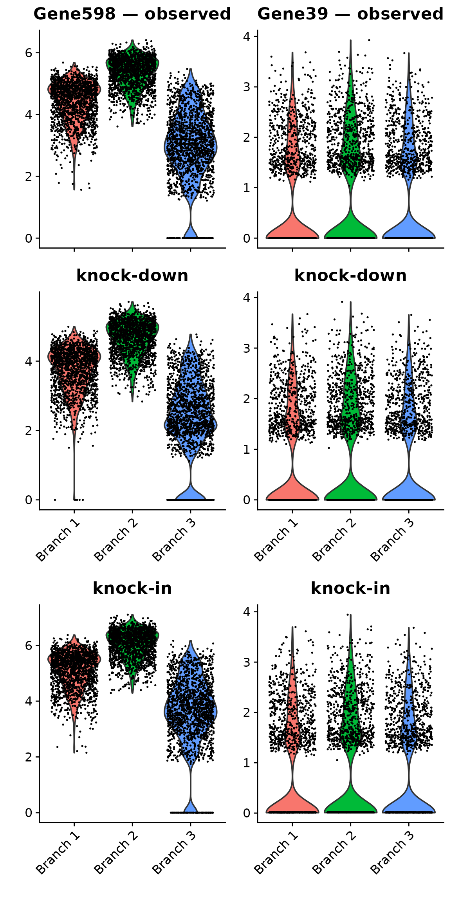

Hub genes should show the largest changes (they are the primary
perturbation targets); secondary genes should show smaller but
consistent changes that reflect the propagated signal through the
network.

### Log2FC scatter plot

`PerturbationLog2FC` computes the log2 fold change for all genes in a
module, comparing the perturbed assay to the baseline. Plotting Log2FC
against kME (module membership score) reveals the network-scaling
property: genes more central to the module (higher kME) should show
larger \|Log2FC\|.

``` r

library(ggrepel)

lfc_down <- PerturbationLog2FC(
    seurat_obj,
    perturbation_name = 'turquoise_down',
    module = cur_mod,
    n_hubs = 10
)

lfc_up <- PerturbationLog2FC(
    seurat_obj,
    perturbation_name = 'turquoise_up',
    module = cur_mod,
    n_hubs = 10
)

# plot for knock-down
p_down <- lfc_down %>%
    ggplot(aes(x = log2fc, y = kME, color = hub, size = avg_exp)) +
    geom_point() +
    geom_text_repel(
        data = subset(lfc_down, hub == 'hub'),
        aes(label = gene_name), size = 3
    ) +
    scale_color_manual(values = c('hub' = 'firebrick', 'other' = 'grey60')) +
    theme(
        panel.border = element_rect(color = 'black', fill = NA, linewidth = 1),
        panel.grid.major = element_line(linewidth = 0.25, color = 'lightgrey')
    ) +
    xlab('Log2FC') + ylab('kME') + ggtitle('turquoise — knock-down') +
    labs(color = '', size = 'avg exp')

# plot for knock-in
p_up <- lfc_up %>%
    ggplot(aes(x = log2fc, y = kME, color = hub, size = avg_exp)) +
    geom_point() +
    geom_text_repel(
        data = subset(lfc_up, hub == 'hub'),
        aes(label = gene_name), size = 3
    ) +
    scale_color_manual(values = c('hub' = 'firebrick', 'other' = 'grey60')) +
    theme(
        panel.border = element_rect(color = 'black', fill = NA, linewidth = 1),
        panel.grid.major = element_line(linewidth = 0.25, color = 'lightgrey')
    ) +
    xlab('Log2FC') + ylab('kME') + ggtitle('turquoise — knock-in') +
    labs(color = '', size = 'avg exp')

p_down | p_up
```

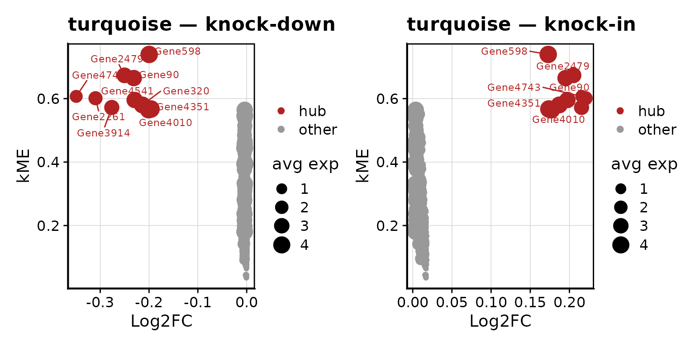

The down-regulation should show negative Log2FC values (expression
decreased), and the up-regulation should show positive values. Hub genes
(labeled) should cluster at the extremes of the Log2FC axis, while
secondary genes scale continuously with their kME.

------------------------------------------------------------------------

## Transition Vector Fields

`PlotTransitionVectors` projects the cell-cell transition probabilities
onto the two-dimensional embedding as a vector field — directly
analogous to an RNA velocity plot. Each arrow on the grid represents the
weighted average direction of transitions in that region of the
embedding.

The points are colored by the turquoise module eigengene, so you can see
where turquoise is expressed relative to where the arrows are pointing.

``` r

# extract the module color for turquoise
modules <- GetModules(seurat_obj)
mod_colors <- dplyr::select(modules, module, color) %>% dplyr::distinct()
mod_cp <- setNames(mod_colors$color, mod_colors$module)
cur_mod_color <- mod_cp[cur_mod]

# knock-down vector field
p_down <- PlotTransitionVectors(
    seurat_obj,
    perturbation_name = 'turquoise_down',
    reduction = 'pca',
    color.by = cur_mod,
    grid_resolution = 25,
    arrow_scale = 2,
    point_alpha = 0.9,
    point_size = 3,
    arrow_size = 0.4,
    max_pct = 0.5,
    arrow_alpha = TRUE
) +
    NoLegend() +
    scale_color_gradient2(high = cur_mod_color, low = 'whitesmoke', mid = 'whitesmoke') +
    ggtitle('turquoise — knock-down') +
    coord_equal()

# knock-in vector field
p_up <- PlotTransitionVectors(
    seurat_obj,
    perturbation_name = 'turquoise_up',
    reduction = 'pca',
    color.by = cur_mod,
    grid_resolution = 25,
    arrow_scale = 2,
    point_alpha = 0.9,
    point_size = 3,
    arrow_size = 0.4,
    max_pct = 0.5,
    arrow_alpha = TRUE
) +
    NoLegend() +
    scale_color_gradient2(high = cur_mod_color, low = 'whitesmoke', mid = 'whitesmoke') +
    ggtitle('turquoise — knock-in') +
    coord_equal()

p_down + p_up
```

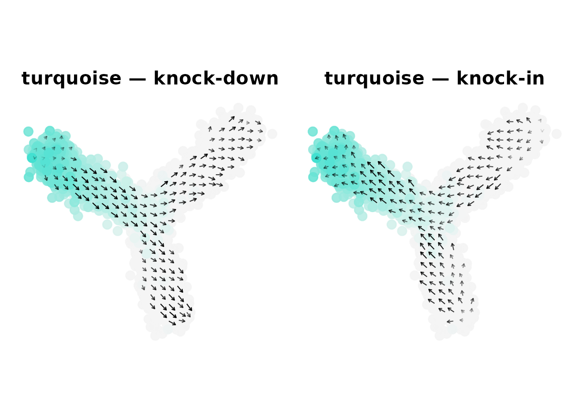

**What to look for:** The two vector fields should be roughly opposite.
In the region where turquoise expression is highest (bright-colored
cells), knock-down arrows should point **away** from that region, and
knock-in arrows should point **toward** it. This is the key biological
validation: the perturbation shifts cell-state transitions in the
direction consistent with the module’s role in differentiation.

**Key parameters:**

- `grid_resolution = 25`: Number of grid points along each axis. Higher
  values give finer spatial resolution but can be noisy with few cells
  per grid square.
- `arrow_scale = 2`: Scales the displayed arrow length for visual
  clarity; does not affect underlying transition probabilities.
- `max_pct = 0.5`: Trims the top 50% of arrow magnitudes before scaling,
  preventing a few extreme arrows from dominating the visualization.
- `arrow_alpha = TRUE`: Fades arrows with smaller magnitudes so that
  stronger transitions stand out visually.

------------------------------------------------------------------------

## Vector Field Coherence

`VectorFieldCoherence` quantifies how **locally consistent** the
perturbation signal is across the embedding. For each cell, it computes
the cosine similarity between that cell’s perturbation vector and those
of its neighbors in the KNN graph. Coherence ranges from −1 (perfectly
anti-aligned with neighbors) to +1 (perfectly aligned), with values near
0 indicating random or mixed directions.

High coherence in a region means the perturbation consistently pushes
cells in the same direction there. Low coherence may indicate cells with
low module expression or cells in a transition zone between two cell
states.

``` r

coherence_down <- VectorFieldCoherence(
    seurat_obj,
    perturbation_name = 'turquoise_down',
    reduction = 'pca',
    graph = 'RNA_snn',
    weighted = TRUE
)
seurat_obj$coherence_down <- coherence_down

coherence_up <- VectorFieldCoherence(
    seurat_obj,
    perturbation_name = 'turquoise_up',
    reduction = 'pca',
    graph = 'RNA_snn',
    weighted = TRUE
)
seurat_obj$coherence_up <- coherence_up
```

Visualize coherence on the embedding:

``` r

plot_df <- as.data.frame(Reductions(seurat_obj, 'pca')@cell.embeddings[, 1:2])
plot_df$coherence <- coherence_down
plot_df$Group <- seurat_obj$Group
plot_df$branch <- seurat_obj$branch

# embedding colored by coherence
p_emb <- plot_df %>% arrange(coherence) %>%
    ggplot(aes(x = PC_1, y = PC_2, color = coherence)) +
    geom_point(alpha = 1, size = 1) +
    scale_color_gradient2(high = 'darkgoldenrod1', mid = 'whitesmoke',
                          low = 'dodgerblue', limits = c(-1, 1)) +
    hdWGCNA::umap_theme() +
    coord_equal() +
    ggtitle('Coherence — knock-down')

print(p_emb)
```


Visualize coherence by group and branch:

``` r

# rank groups by median coherence for display
group_order <- plot_df %>%
    group_by(Group) %>%
    summarise(med = median(coherence)) %>%
    arrange(med) %>%
    pull(Group)
plot_df$Group <- factor(plot_df$Group, levels = group_order)

p_vln <- plot_df %>%
    ggplot(aes(x = coherence, y = Group, color = Group)) +
    geom_boxplot(outlier.shape = NA, alpha = 0.3, color = 'black') +
    scale_color_manual(values = cp) +
    theme(
        panel.border = element_rect(linewidth = 1, color = 'black', fill = NA),
        strip.text = element_text(size = 10)
    ) +
    NoLegend() +
    xlab('Local coherence') + ylab('') +
    xlim(c(-1, 1)) +
    facet_wrap(vars(branch), ncol = 1, scales = 'free_y')

print(p_vln)
```

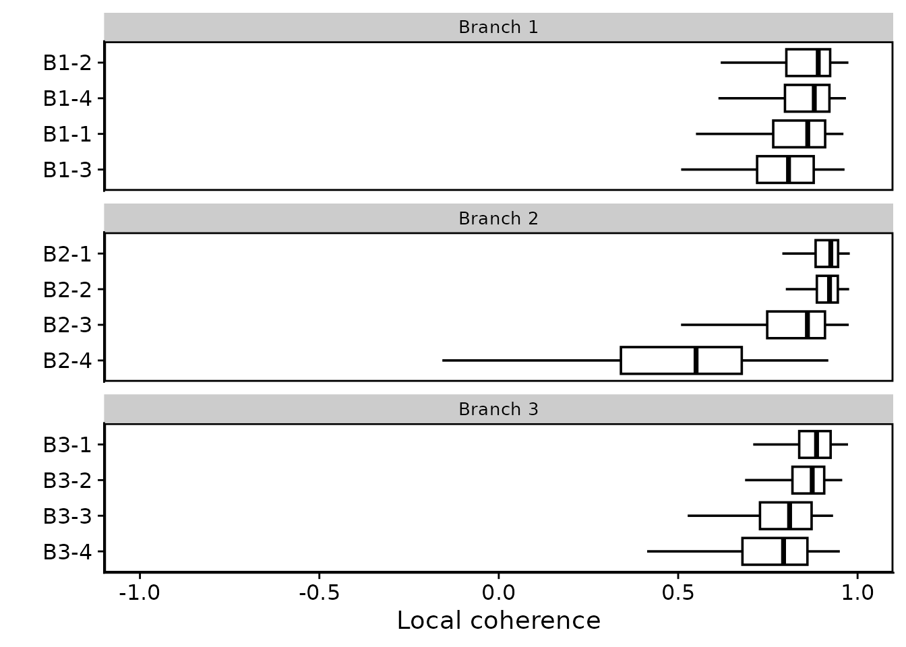

**Expected result:** Cells in the branch where turquoise is most highly
expressed should show higher coherence — their perturbation vectors
agree with their neighbors because they all respond similarly to the
turquoise module’s suppression. Cells on other branches, where turquoise
expression is low, may show lower or near-zero coherence.

------------------------------------------------------------------------

## Macrostate Transition Matrix (`MacrostateTransitions`)

`PlotTransitionVectors` shows per-cell transition directions projected
onto the UMAP — informative but inherently limited by embedding
distortions. `MacrostateTransitions` provides a complementary
**embedding-independent** view: it coarse-grains the full-dimensional
transition probability matrix into a K × K group-level summary,
answering the question “on average, when a cell in group A transitions,
where does it go?”

The result is a matrix **Q** where each entry Q\[source, destination\]
is the mean transition probability from any cell in the source group to
any cell in the destination group. The **diagonal** of Q is the
**stability index** — the fraction of a group’s outgoing transitions
that stay within the same group. A stability close to 1 signals an
attractor-like state that resists the perturbation; low stability marks
a transient source population whose cells are being redirected
elsewhere.

### Knock-down

``` r

seurat_obj <- MacrostateTransitions(
    seurat_obj,
    perturbation_name = 'turquoise_down',
    graph             = 'RNA_snn',
    group.by          = 'Group'
)
```

``` r

# arrange groups in trajectory order so the heatmap reads root → tip left-to-right
group_order <- c(
    'B1-1', 'B1-2', 'B1-3', 'B1-4',
    'B2-1', 'B2-2', 'B2-3', 'B2-4',
    'B3-1', 'B3-2', 'B3-3', 'B3-4'
)

PlotMacrostateTransitions(
    seurat_obj,
    perturbation_name = 'turquoise_down',
    group_order       = group_order,
    title             = 'Turquoise knock-down — macrostate transitions'
)
```

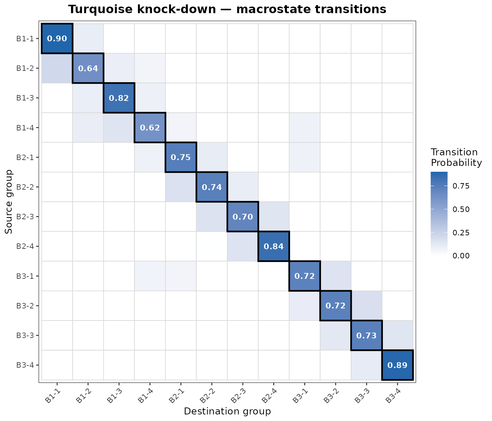

Read the heatmap row by row: each row is a source group; the tile
intensities tell you where its cells are predicted to transition.
**Strong diagonal tiles** (high self-transition probability) indicate
stable groups that the perturbation does not displace. **Strong
off-diagonal tiles** in a row indicate groups from which cells are being
redirected to a different destination.

**Expected result:** Terminal tip groups — particularly those enriched
for the turquoise module — should show a reduced stability index under
the knock-down, as their characteristic expression is directly
disrupted. Cells currently occupying those groups are predicted to
scatter toward neighboring branches rather than remain in place.

### Knock-in vs knock-down comparison

Running `MacrostateTransitions` on both perturbations and plotting them
side-by-side makes the directional contrast explicit. Groups that are
stable under one perturbation but unstable under the other are the most
informative about the turquoise module’s role in maintaining those
states.

``` r

seurat_obj <- MacrostateTransitions(
    seurat_obj,
    perturbation_name = 'turquoise_up',
    graph             = 'RNA_snn',
    group.by          = 'Group'
)
```

``` r

p_down <- PlotMacrostateTransitions(
    seurat_obj,
    perturbation_name = 'turquoise_down',
    group_order       = group_order,
    title             = 'Knock-down'
)

p_up <- PlotMacrostateTransitions(
    seurat_obj,
    perturbation_name = 'turquoise_up',
    group_order       = group_order,
    title             = 'Knock-in'
)

p_down | p_up
```

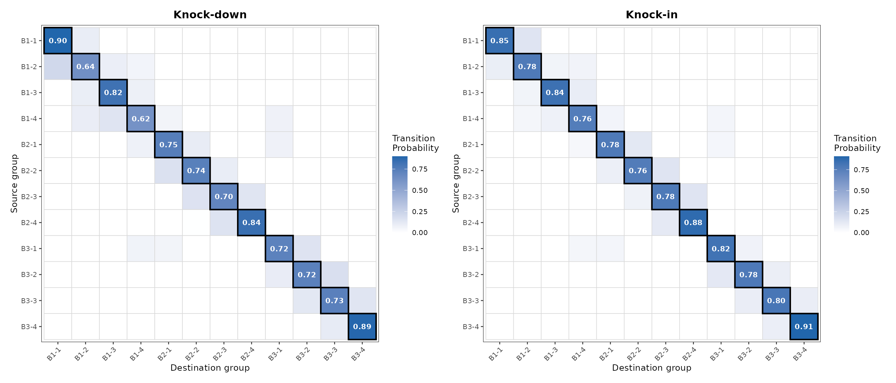

Under the knock-in, the turquoise-enriched terminal groups should show
*higher* stability than under baseline (the module is reinforced), while
early progenitor groups may show increased off-diagonal outflow toward
the turquoise branch tip. The two heatmaps together form a mirror image:
the groups that destabilize under knock-down are stabilized under
knock-in, and vice versa.

### Stability bar chart

The stability index — the diagonal of Q — can be extracted and plotted
directly to compare group-level resistance to the perturbation:

``` r

stab_down <- seurat_obj@misc$MacrostateTransitions[['turquoise_down']]$stability
stab_up   <- seurat_obj@misc$MacrostateTransitions[['turquoise_up']]$stability

stab_df <- data.frame(
    group       = rep(names(stab_down), 2),
    stability   = c(stab_down, stab_up),
    perturbation = rep(c('knock-down', 'knock-in'), each = length(stab_down))
)
stab_df$group <- factor(stab_df$group, levels = group_order)

ggplot(stab_df, aes(x = group, y = stability, fill = perturbation)) +
    geom_col(position = position_dodge(width = 0.7), width = 0.65) +
    scale_fill_manual(values = c('knock-down' = 'steelblue3', 'knock-in' = 'firebrick3')) +
    theme(
        axis.text.x      = element_text(angle = 45, hjust = 1),
        panel.border     = element_rect(linewidth = 1, color = 'black', fill = NA),
        panel.grid.major.y = element_line(linewidth = 0.25, color = 'lightgrey')
    ) +
    xlab('') + ylab('Stability index') +
    ylim(c(0, 1)) +
    ggtitle('Group stability index — knock-down vs knock-in')
```

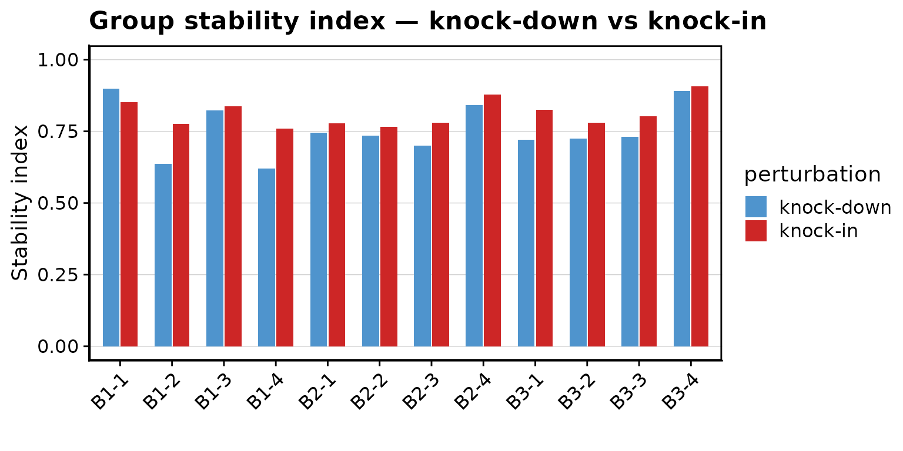

Groups where the two bars are roughly equal are insensitive to the
turquoise module in either direction. Groups with a large knock-down vs
knock-in gap are the most directly regulated by turquoise: they
destabilize when turquoise is suppressed and become more “sticky” when
it is amplified.

------------------------------------------------------------------------

## Cell Fate Markov Chain Analyses

`compact` provides four functions that treat the transition probability
matrix as a Markov chain and extract different types of cell-fate
information. All four are illustrated here using the **knock-down**
perturbation of the turquoise module.

### Shared setup: defining sink cells

For several of the analyses below, we must specify **sink cells** — a
set of cells that serve as absorbing states in the Markov chain. We
define them simply as all cells in the earliest pseudotime group,
`B1-1`, which sits at the shared root region of the trajectory:

``` r

perturb_name <- 'turquoise_down'

# define sink cells by group membership (root of the trajectory)
sink_cells <- colnames(seurat_obj)[seurat_obj$Group == 'B1-1']
```

### Perturbation Pseudotime (`PredictPerturbationTime`)

`PredictPerturbationTime` sets up an **absorbing Markov chain** with the
sink cells as absorbing states and computes the expected number of steps
each cell needs to reach the sink. This is analogous to RNA velocity
pseudotime, but derived from in-silico perturbation transition
probabilities.

``` r

seurat_obj <- PredictPerturbationTime(
    seurat_obj,
    sink_cells = sink_cells,
    perturbation_name = perturb_name,
    graph = 'RNA_snn'
)
```

Visualize on the embedding:

``` r

p <- PlotTransitionVectors(
    seurat_obj,
    perturbation_name = perturb_name,
    reduction = 'pca',
    color.by = 'perturbation_pseudotime',
    grid_resolution = 25,
    arrow_scale = 2,
    point_alpha = 0.9,
    point_size = 3,
    arrow_size = 0.4,
    max_pct = 0.5,
    arrow_alpha = TRUE
) + scale_color_gradientn(colors = viridis::plasma(256)) +
    coord_equal() +
    ggtitle('Perturbation pseudotime — knock-down')

print(p)
```

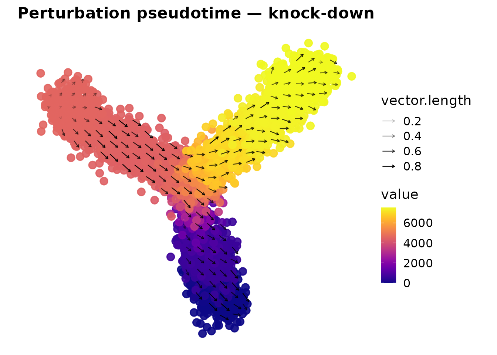

Cells far from the sink in transition probability space will have high
pseudotime values. When turquoise is knocked down, cells that would
normally move toward the turquoise-enriched branch should instead
require many more steps (or move in a different direction) to reach the
root.

### Attractor Identification (`PredictAttractors`)

`PredictAttractors` computes the **stationary distribution** of the
transition probability Markov chain — the long-run probability of
finding the random walk at each cell. Cells with high stationary
probability act as attractors, or “sinks,” in the perturbation dynamics.

``` r

seurat_obj <- PredictAttractors(
    seurat_obj,
    perturbation_name = perturb_name,
    graph = 'RNA_snn'
)

p <- PlotTransitionVectors(
    seurat_obj,
    perturbation_name = perturb_name,
    reduction = 'pca',
    color.by = 'attractor_score',
    grid_resolution = 25,
    arrow_scale = 2,
    point_alpha = 0.9,
    point_size = 3,
    arrow_size = 0.4,
    max_pct = 0.5,
    arrow_alpha = TRUE
) + scale_color_gradient(low = 'whitesmoke', high = 'darkorchid3') +
    coord_equal() +
    ggtitle('Attractor score — knock-down')

print(p)
```

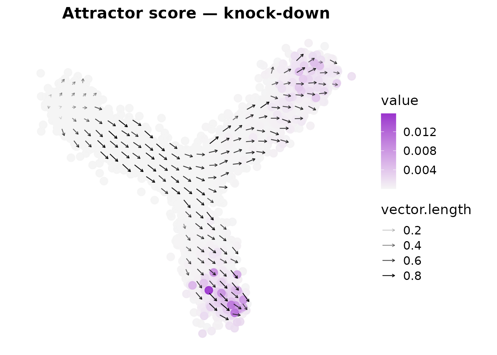

Terminal states on the branches that the perturbation drives cells
toward should show the highest attractor scores. After turquoise
knock-down, we expect the attractor mass to shift away from the
turquoise-enriched branch tip.

### Fate Prediction (`PredictFates`)

`PredictFates` computes the **committor probability** — the probability
that a random walk starting from each cell will reach a specified target
group before leaving the graph. This answers the question: “Given where
this cell is, how likely is it to end up in state X?”

Here we ask: what fraction of the time does the perturbed random walk
reach `B1-4` (the tip of Branch 1)?

``` r

seurat_obj <- PredictFates(
    seurat_obj,
    perturbation_name = perturb_name,
    graph = 'RNA_snn',
    group.by = 'Group',
    group_name = 'B1-4'
)

p <- PlotTransitionVectors(
    seurat_obj,
    perturbation_name = perturb_name,
    reduction = 'pca',
    color.by = 'forward_fate',
    grid_resolution = 25,
    arrow_scale = 2,
    point_alpha = 0.9,
    point_size = 3,
    arrow_size = 0.4,
    max_pct = 0.5,
    arrow_alpha = TRUE
) + scale_color_gradient(low = 'whitesmoke', high = 'darkorchid3') +
    coord_equal() +
    ggtitle('Fate toward B1-4 — knock-down')

print(p)
```

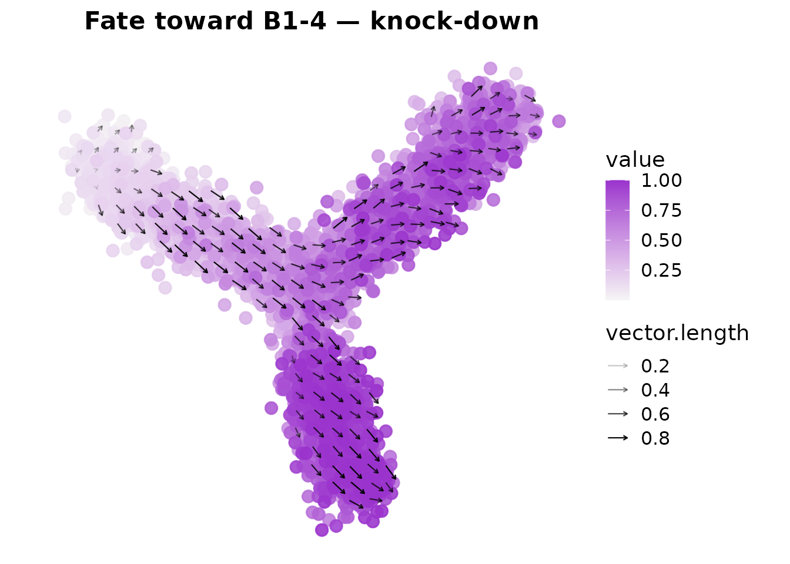

Cells on Branch 1 should have high fate probability toward `B1-4`. If
turquoise drives differentiation along a different branch, knocking it
down should not dramatically alter Branch 1 fate probabilities, while
fate probabilities toward the turquoise-enriched branch tip should
decrease.

### Commitment Score (`PredictCommitment`)

`PredictCommitment` computes the committor probability **between two
specified groups** — a source and a sink. It quantifies how committed
each cell is to transitioning from the source state toward the sink
state.

``` r

seurat_obj <- PredictCommitment(
    seurat_obj,
    perturbation_name = perturb_name,
    graph = 'RNA_snn',
    group.by = 'Group',
    source_group = 'B1-1',
    sink_group = 'B1-4'
)

p <- PlotTransitionVectors(
    seurat_obj,
    perturbation_name = perturb_name,
    reduction = 'pca',
    color.by = 'commitment_score',
    grid_resolution = 25,
    arrow_scale = 2,
    point_alpha = 0.9,
    point_size = 3,
    arrow_size = 0.4,
    max_pct = 0.5,
    arrow_alpha = TRUE
) + scale_color_gradient(low = 'whitesmoke', high = 'darkorchid3') +
    coord_equal() +
    ggtitle('Commitment: B1-1 → B1-4 (knock-down)')

print(p)
```

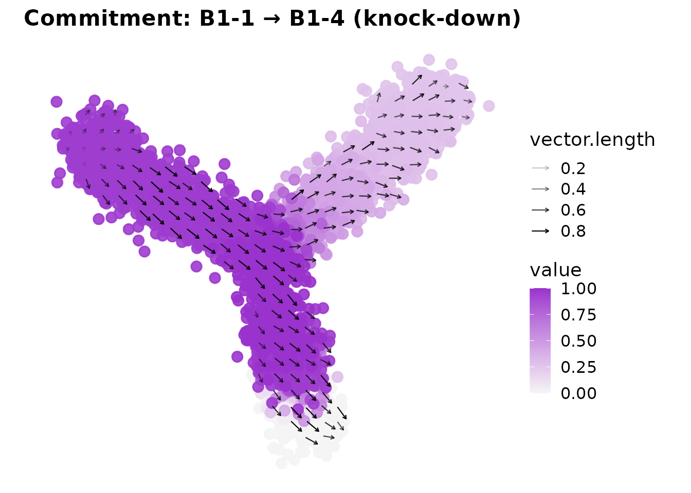

Cells along the Branch 1 trajectory should show a gradient from 0 (at
`B1-1`, the source) to 1 (at `B1-4`, the sink). Cells on Branches 2 and
3 should have lower commitment scores for this source–sink pair, since
their perturbation-driven transitions are not directed toward `B1-4`.

------------------------------------------------------------------------

## Summary and Next Steps

In this tutorial we used **`compact`** to perform in-silico module
perturbations on a simulated branching trajectory and validated the
results against the known ground truth. We:

1.  Loaded a pre-processed Seurat object with hdWGCNA co-expression
    modules already embedded.
2.  Built a KNN graph with `FindNeighbors` to define the local cell
    neighborhoods.
3.  Ran `ModulePerturbation` to knock down and knock in the
    **turquoise** module, producing perturbed expression matrices and
    transition probability graphs.
4.  Verified expression changes with violin plots and
    `PerturbationLog2FC` — hub genes showed the largest changes, scaling
    with kME.
5.  Visualized cell-state transitions as vector fields with
    `PlotTransitionVectors` — the two directions produced opposite
    fields as expected.
6.  Quantified the local consistency of those transitions with
    `VectorFieldCoherence`.
7.  Coarse-grained the transition probability matrix to the group level
    with `MacrostateTransitions`, reading group-level stability indices
    and cross-group flow from the Q matrix heatmap.
8.  Performed Markov chain analyses to extract pseudotime
    (`PredictPerturbationTime`), attractors (`PredictAttractors`), fate
    probabilities (`PredictFates`), and commitment scores
    (`PredictCommitment`).

The same workflow applies directly to real biological datasets. For a
tutorial using Alzheimer’s disease microglia or NSCLC data, see the
**basic tutorial** (coming soon).

For transcription factor–based perturbations using `TFPerturbation`, see
the **TF perturbation tutorial** (coming soon).

**Session information (click to expand)**

``` r

sessionInfo()
#> R version 4.5.3 (2026-03-11)
#> Platform: x86_64-conda-linux-gnu
#> Running under: CentOS Linux 7 (Core)
#> 
#> Matrix products: default
#> BLAS/LAPACK: /home/groups/singlecell/smorabito/.conda/envs/compact_fresh/lib/libopenblasp-r0.3.32.so;  LAPACK version 3.12.0
#> 
#> locale:
#>  [1] LC_CTYPE=en_US.UTF-8       LC_NUMERIC=C              
#>  [3] LC_TIME=en_US.UTF-8        LC_COLLATE=en_US.UTF-8    
#>  [5] LC_MONETARY=en_US.UTF-8    LC_MESSAGES=en_US.UTF-8   
#>  [7] LC_PAPER=en_US.UTF-8       LC_NAME=C                 
#>  [9] LC_ADDRESS=C               LC_TELEPHONE=C            
#> [11] LC_MEASUREMENT=en_US.UTF-8 LC_IDENTIFICATION=C       
#> 
#> time zone: Europe/Madrid
#> tzcode source: system (glibc)
#> 
#> attached base packages:
#> [1] stats4    stats     graphics  grDevices utils     datasets  methods  
#> [8] base     
#> 
#> other attached packages:
#>  [1] future_1.70.0               compact_0.1.0              
#>  [3] hdWGCNA_0.4.11              enrichR_3.4                
#>  [5] SummarizedExperiment_1.40.0 Biobase_2.70.0             
#>  [7] MatrixGenerics_1.22.0       matrixStats_1.5.0          
#>  [9] GenomicRanges_1.62.1        Seqinfo_1.0.0              
#> [11] IRanges_2.44.0              S4Vectors_0.48.0           
#> [13] BiocGenerics_0.56.0         generics_0.1.4             
#> [15] GeneOverlap_1.46.0          UCell_2.14.0               
#> [17] tidygraph_1.3.0             ggraph_2.2.2               
#> [19] igraph_2.3.1                WGCNA_1.74                 
#> [21] fastcluster_1.3.0           dynamicTreeCut_1.63-1      
#> [23] ggrepel_0.9.8               harmony_2.0.2              
#> [25] Rcpp_1.1.1-1.1              RColorBrewer_1.1-3         
#> [27] patchwork_1.3.2             cowplot_1.2.0              
#> [29] lubridate_1.9.5             forcats_1.0.1              
#> [31] stringr_1.6.0               dplyr_1.2.1                
#> [33] purrr_1.2.2                 readr_2.2.0                
#> [35] tidyr_1.3.2                 tibble_3.3.1               
#> [37] ggplot2_4.0.3               tidyverse_2.0.0            
#> [39] Seurat_5.5.0                SeuratObject_5.4.0         
#> [41] sp_2.2-1                   
#> 
#> loaded via a namespace (and not attached):
#>   [1] fs_2.1.0                    spatstat.sparse_3.1-0      
#>   [3] bitops_1.0-9                httr_1.4.8                 
#>   [5] doParallel_1.0.17           tools_4.5.3                
#>   [7] sctransform_0.4.3           backports_1.5.1            
#>   [9] R6_2.6.1                    lazyeval_0.2.3             
#>  [11] uwot_0.2.4                  withr_3.0.2                
#>  [13] gridExtra_2.3               preprocessCore_1.72.0      
#>  [15] progressr_0.19.0            cli_3.6.6                  
#>  [17] textshaping_1.0.5           Cairo_1.7-0                
#>  [19] spatstat.explore_3.8-0      fastDummies_1.7.6          
#>  [21] labeling_0.4.3              sass_0.4.10                
#>  [23] S7_0.2.2                    spatstat.data_3.1-9        
#>  [25] proxy_0.4-29                ggridges_0.5.7             
#>  [27] pbapply_1.7-4               pkgdown_2.2.0              
#>  [29] systemfonts_1.3.2           foreign_0.8-91             
#>  [31] pscl_1.5.9                  parallelly_1.47.0          
#>  [33] WriteXLS_6.8.0              VGAM_1.1-14                
#>  [35] rstudioapi_0.18.0           impute_1.84.0              
#>  [37] gtools_3.9.5                ica_1.0-3                  
#>  [39] spatstat.random_3.4-5       car_3.1-5                  
#>  [41] Matrix_1.7-5                ggbeeswarm_0.7.3           
#>  [43] abind_1.4-8                 lifecycle_1.0.5            
#>  [45] yaml_2.3.12                 carData_3.0-6              
#>  [47] gplots_3.3.0                SparseArray_1.10.8         
#>  [49] Rtsne_0.17                  grid_4.5.3                 
#>  [51] promises_1.5.0              miniUI_0.1.2               
#>  [53] lattice_0.22-9              pillar_1.11.1              
#>  [55] knitr_1.51                  rjson_0.2.23               
#>  [57] xgboost_3.2.0.1             future.apply_1.20.2        
#>  [59] codetools_0.2-20            glue_1.8.1                 
#>  [61] spatstat.univar_3.1-7       data.table_1.18.2.1        
#>  [63] vctrs_0.7.3                 png_0.1-9                  
#>  [65] spam_2.11-3                 gtable_0.3.6               
#>  [67] cachem_1.1.0                xfun_0.57                  
#>  [69] S4Arrays_1.10.1             mime_0.13                  
#>  [71] survival_3.8-6              SingleCellExperiment_1.32.0
#>  [73] iterators_1.0.14            fitdistrplus_1.2-6         
#>  [75] ROCR_1.0-12                 nlme_3.1-169               
#>  [77] SHAPforxgboost_0.2.0        RcppAnnoy_0.0.23           
#>  [79] bslib_0.10.0                irlba_2.3.7                
#>  [81] vipor_0.4.7                 KernSmooth_2.23-26         
#>  [83] otel_0.2.0                  rpart_4.1.27               
#>  [85] colorspace_2.1-2            Hmisc_5.2-5                
#>  [87] nnet_7.3-20                 ggrastr_1.0.2              
#>  [89] tidyselect_1.2.1            compiler_4.5.3             
#>  [91] curl_7.1.0                  htmlTable_2.5.0            
#>  [93] BiocNeighbors_2.4.0         desc_1.4.3                 
#>  [95] DelayedArray_0.36.0         plotly_4.12.0              
#>  [97] checkmate_2.3.4             scales_1.4.0               
#>  [99] caTools_1.18.3              lmtest_0.9-40              
#> [101] digest_0.6.39               goftest_1.2-3              
#> [103] spatstat.utils_3.2-2        rmarkdown_2.31             
#> [105] XVector_0.50.0              htmltools_0.5.9            
#> [107] pkgconfig_2.0.3             base64enc_0.1-6            
#> [109] fastmap_1.2.0               rlang_1.2.0                
#> [111] htmlwidgets_1.6.4           BBmisc_1.13.1              
#> [113] shiny_1.13.0                farver_2.1.2               
#> [115] jquerylib_0.1.4             zoo_1.8-15                 
#> [117] jsonlite_2.0.0              BiocParallel_1.44.0        
#> [119] magrittr_2.0.5              Formula_1.2-5              
#> [121] dotCall64_1.2               viridis_0.6.5              
#> [123] reticulate_1.46.0           stringi_1.8.7              
#> [125] MASS_7.3-65                 plyr_1.8.9                 
#> [127] parallel_4.5.3              listenv_0.10.1             
#> [129] deldir_2.0-4                graphlayouts_1.2.3         
#> [131] splines_4.5.3               tensor_1.5.1               
#> [133] hms_1.1.4                   rdist_0.0.5                
#> [135] ggpubr_0.6.3                spatstat.geom_3.7-3        
#> [137] ggsignif_0.6.4              RcppHNSW_0.6.0             
#> [139] reshape2_1.4.5              evaluate_1.0.5             
#> [141] tester_0.3.0                tzdb_0.5.0                 
#> [143] foreach_1.5.2               tweenr_2.0.3               
#> [145] httpuv_1.6.17               RANN_2.6.2                 
#> [147] polyclip_1.10-7             scattermore_1.2            
#> [149] ggforce_0.5.0               broom_1.0.12               
#> [151] xtable_1.8-8                RSpectra_0.16-2            
#> [153] rstatix_0.7.3               later_1.4.8                
#> [155] viridisLite_0.4.3           ragg_1.5.2                 
#> [157] beeswarm_0.4.0              memoise_2.0.1              
#> [159] cluster_2.1.8.2             timechange_0.4.0           
#> [161] globals_0.19.1
```
